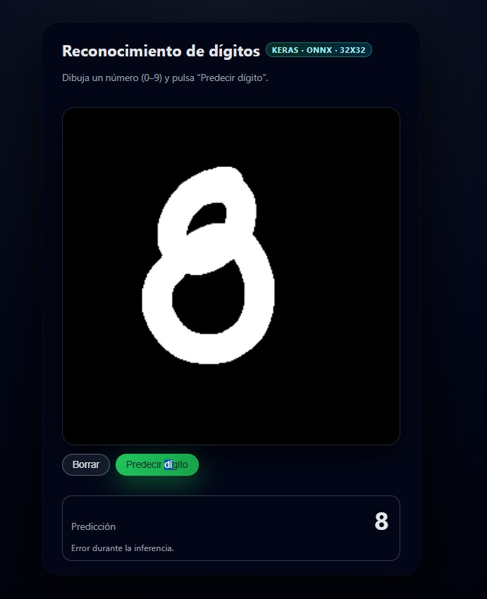
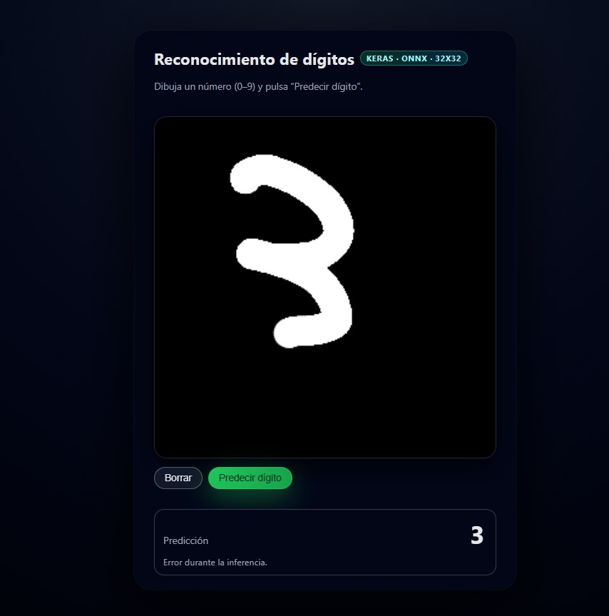
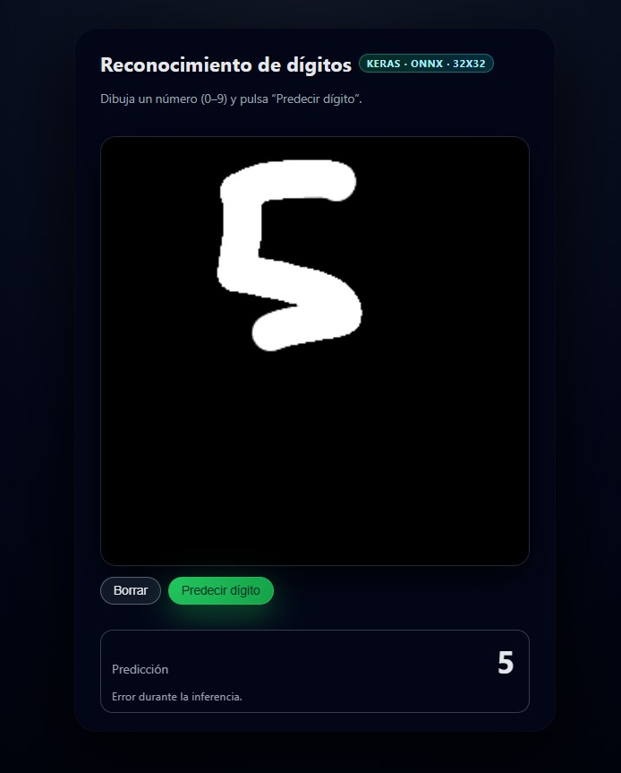
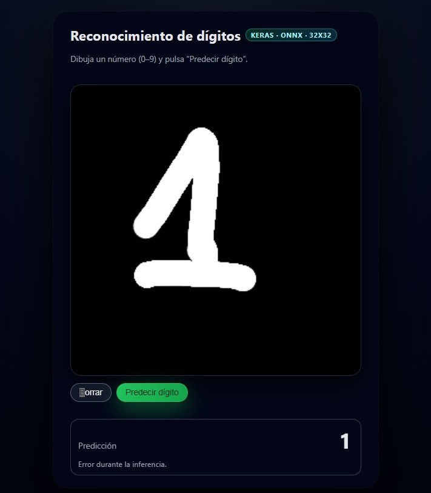

# MNIST Digit Recognition (CNN + ONNX)

## Project Description

MNIST Digit Recognition is an end-to-end handwritten digit classifier that lets users draw numbers (0–9) in the browser and get real-time predictions powered by a convolutional neural network.

The project trains a **CNN on the MNIST dataset** with Keras/TensorFlow, exports the model to **ONNX** for portable inference, and runs predictions entirely in the browser using **ONNX Runtime Web** (WASM). The web interface captures strokes on a canvas, preprocesses the image to match MNIST conventions (32×32 grayscale, white digits on black background), and returns the predicted digit with a confidence score.

The workflow covers the full ML lifecycle: data loading and augmentation, model training and evaluation, ONNX export, and client-side deployment without a backend server.

---

## Technologies Used

- **Python** – Training pipeline and model export
- **TensorFlow / Keras** – CNN architecture, training, and evaluation
- **MNIST** – Standard handwritten digit dataset (28×28, resized to 32×32)
- **tf2onnx** – Keras → ONNX conversion
- **ONNX Runtime Web** – In-browser inference via WASM
- **HTML5 Canvas** – Drawing input (mouse and touch)
- **JavaScript** – Preprocessing, tensor creation, and prediction UI

---

## Main Features

- CNN with three convolutional blocks (32 → 64 → 128 filters) and dense classifier head
- MNIST preprocessing: resize to 32×32, grayscale normalization to [0, 1]
- Data augmentation during training (rotation, zoom, translation)
- Model persistence in Keras (`.h5`) and ONNX (`.onnx`) formats
- Interactive drawing canvas with mouse and touch support
- Client-side inference without Python or GPU at runtime
- Real-time digit prediction with confidence percentage
- Responsive dark-themed web UI
- Reusable training script (train once, export, deploy)

---

## ML Pipeline

1. **Data loading** – Download MNIST via `keras.datasets`, normalize pixels to [0, 1]
2. **Resizing** – Scale 28×28 images to 32×32 for consistent input shape
3. **Data augmentation** – Apply random rotation, zoom, and translation during training
4. **Model training** – Train CNN with Adam optimizer and sparse categorical crossentropy
5. **Evaluation** – Measure accuracy on the MNIST test set
6. **ONNX export** – Convert the trained Keras model with tf2onnx (opset 13)
7. **Browser inference** – Load ONNX with ONNX Runtime Web, preprocess canvas input, run prediction

---

## Model Architecture

| Layer | Details |
|-------|---------|
| Input | 32×32×1 grayscale |
| Conv block 1 | Conv2D(32) → MaxPool |
| Conv block 2 | Conv2D(64) → MaxPool |
| Conv block 3 | Conv2D(128) → MaxPool |
| Classifier | Flatten → Dense(128) → Dropout(0.5) → Dense(10, softmax) |

- **Optimizer:** Adam  
- **Loss:** Sparse categorical crossentropy  
- **Default training:** 10 epochs, batch size 128, 10% validation split  

---

## Project Structure

```text
Practica4/
├── train_cnn_mnist_onnx.py   # Train CNN, save Keras model, export ONNX
├── index.html                # Web UI (canvas + prediction panel)
├── main.js                   # Canvas logic, preprocessing, ONNX inference
├── models/                   # Generated models (not included until training)
│   ├── mnist_cnn_32x32.h5    # Keras weights
│   └── mnist_cnn_32x32.onnx  # ONNX model for the browser
├── requirements.txt
└── README.md
```

---

## Screenshots


### Prediction Result






---

## Installation

Clone the repository:

```bash
git clone https://github.com/germanmm04/handwritten-digit-recognition
cd mnist-digit-recognition-onnx
```

Create a virtual environment and install Python dependencies:

```bash
python -m venv .venv
.venv\Scripts\activate        # Windows
# source .venv/bin/activate   # macOS / Linux
pip install -r requirements.txt
```

Train the model and generate the ONNX file (required before using the web app):

```bash
python train_cnn_mnist_onnx.py
```

This creates `models/mnist_cnn_32x32.h5` and `models/mnist_cnn_32x32.onnx`.

---

## Usage

### Train or retrain the model

```bash
python train_cnn_mnist_onnx.py
```

If `models/mnist_cnn_32x32.h5` already exists, the script loads it and only re-exports ONNX. Delete the `.h5` file to train from scratch.

### Run the web interface

Serve the project folder with any static HTTP server (required for ONNX loading):

```bash
# Python 3
python -m http.server 8000
```

Open in your browser:

```text
http://127.0.0.1:8000
```

Draw a digit on the canvas and click **Predecir dígito** to see the prediction and confidence.

---

## What I Learned

- Building and training convolutional neural networks with Keras
- Image preprocessing pipelines for MNIST-style input
- Data augmentation techniques for digit recognition robustness
- Exporting TensorFlow/Keras models to ONNX for cross-platform deployment
- Running ML inference in the browser with ONNX Runtime Web (WASM)
- Mapping canvas pixel data to model input tensors (NHWC layout)
- Designing a lightweight, serverless ML demo with HTML5 Canvas
- Bridging Python training workflows with JavaScript inference clients

---

## Future Improvements

- Add a live preview of the 32×32 preprocessed image sent to the model
- Display top-3 predictions with probability bars
- Support model quantization for faster WASM inference
- Add a simple Flask/FastAPI backend as an alternative to browser-only inference
- Include automated tests for preprocessing and ONNX output consistency
- Deploy as a static site (GitHub Pages, Netlify, Vercel)
- Experiment with deeper architectures or transfer learning
- Add drawing stroke width control and undo history

---

## Author

Personal project developed as part of my portfolio in **Artificial Intelligence**, **Big Data**, and **Software Development**.

**GitHub:** [germanmm04](https://github.com/germanmm04)
